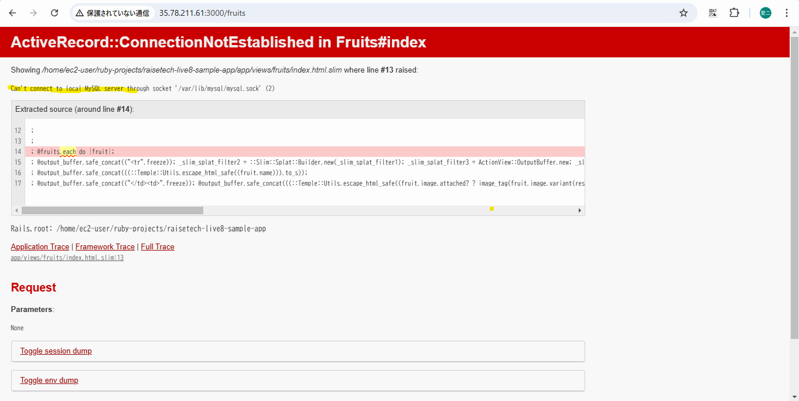

# 第3回課題

## APサーバー
### 名前とバージョン
Puma 6.4.2（ソースは以下画像に示す）

### サーバー起動時のコマンドとアクセス状況

### サーバー終了時のコマンドとアクセス状況
　アクセス時に接続拒否を確認した。

## DBサーバー
### 名前とバージョン
MySQL 8.4.3

### サーバー終了時のコマンドとアクセス状況
　アクセス時にMySQLに接続できない旨を確認した。

## Rails の構成管理ツール
名前：Bundler

## 感想
　他者の作成した設定アプリを起動する場合でも、前提を間違っていると一筋縄ではいかないことを学んだ。最初はEC2のhomeのruby-projects内に対象のリポジトリをクローンしたが、設定ファイルの内容と齟齬が生じるため、home直下にクローンする方針に早めに切り替えられたのはよかった。