# 第5回課題

## サンプルアプリケーションのデプロイおよび動作

### PumaでのRailsアプリ動作確認
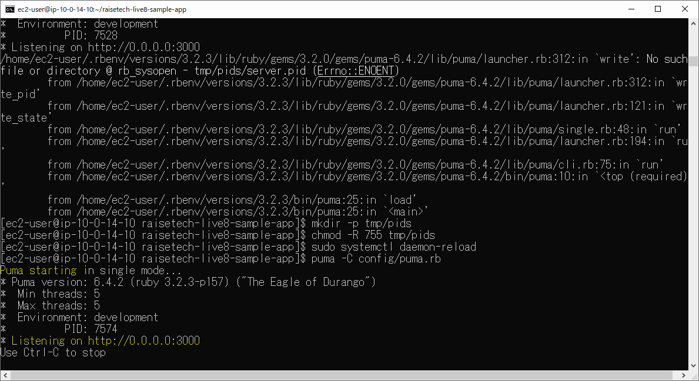
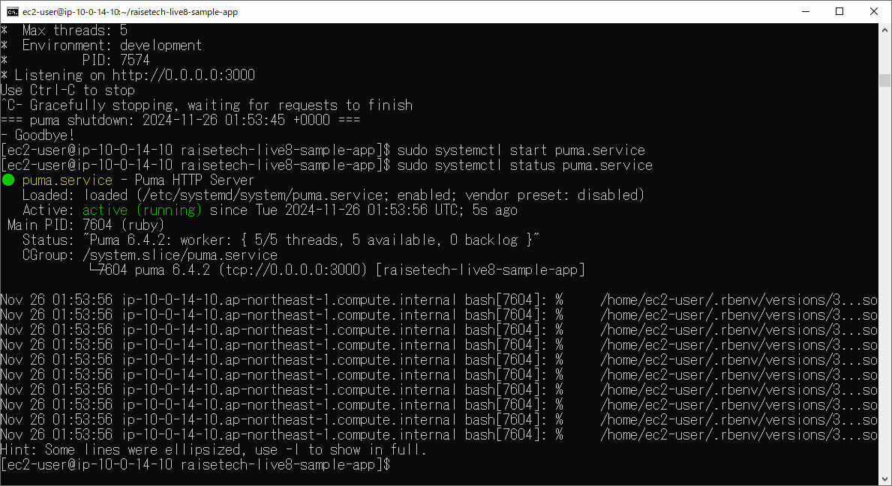

### 組み込みサーバーとUnix Socketを使ったRailsアプリの動作確認
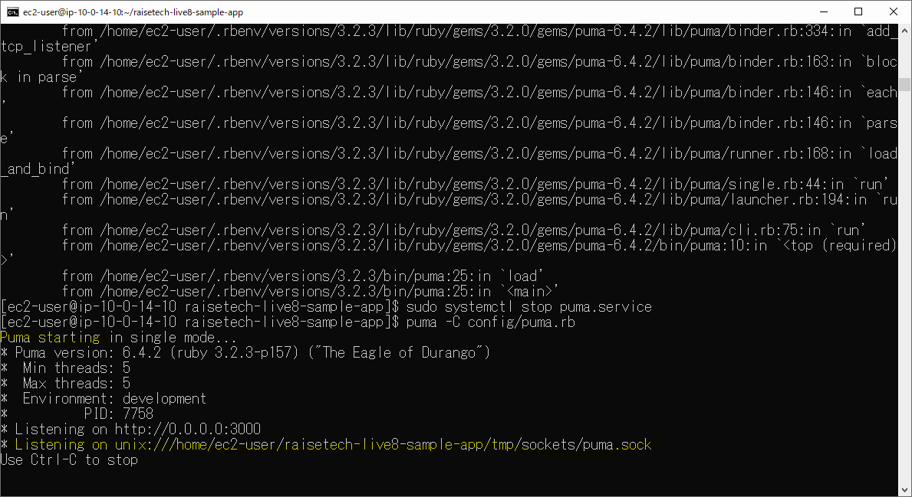
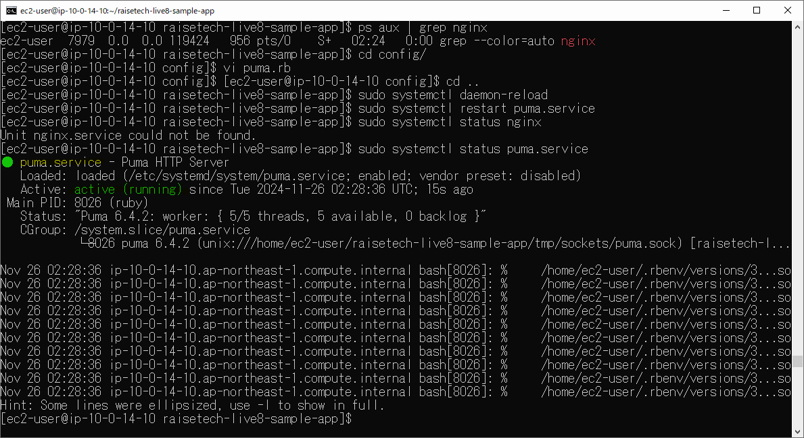
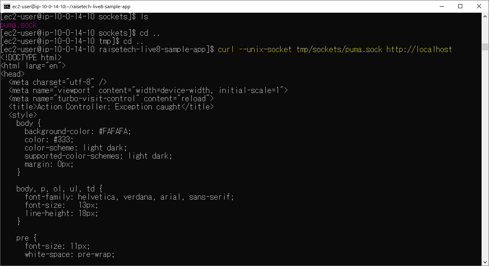

### Nginxの単体起動確認

### Nginxと組み込みサーバー、Unix Socketを組み合わせてのRailsアプリケーション動作確認
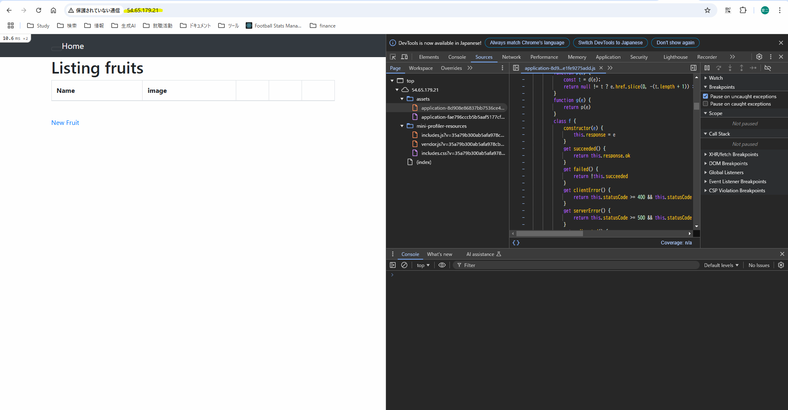

## ELB(ALB)の追加
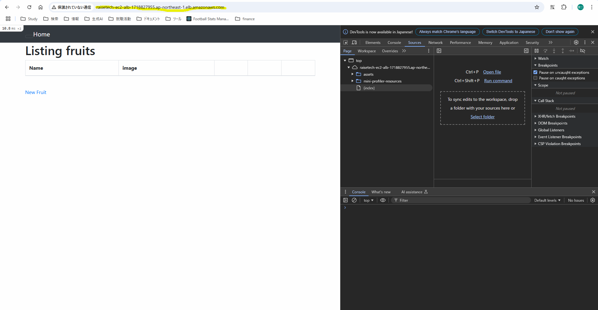

## S3の追加

### 登録動作
#### 登録前
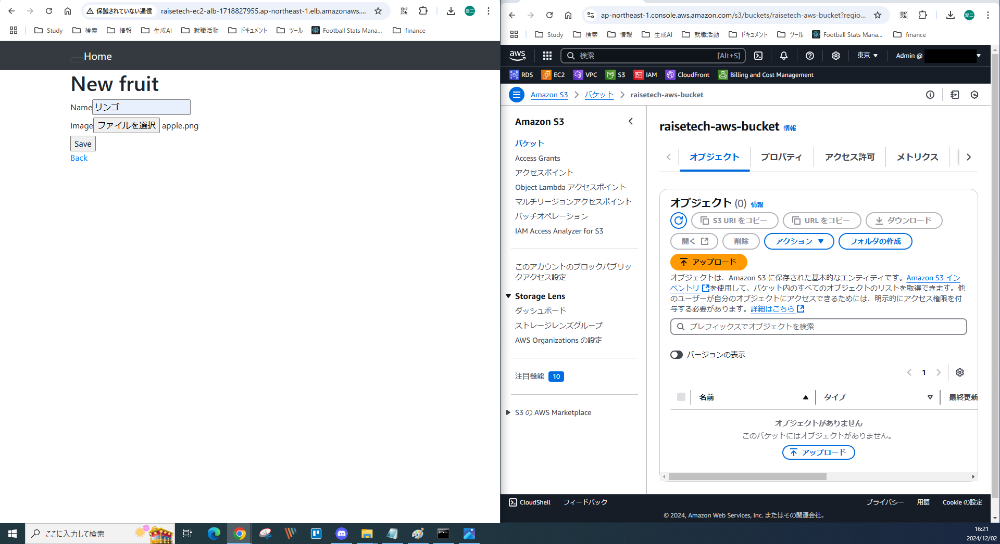
#### 登録後
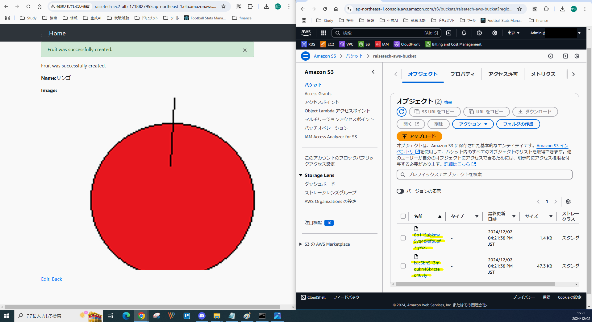
#### Home遷移後
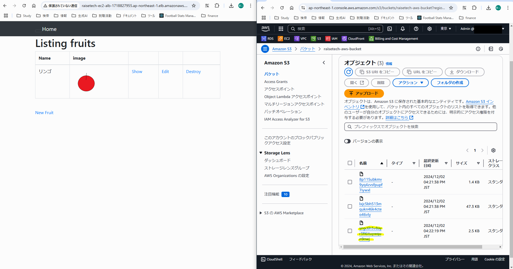
#### S3内の各画像
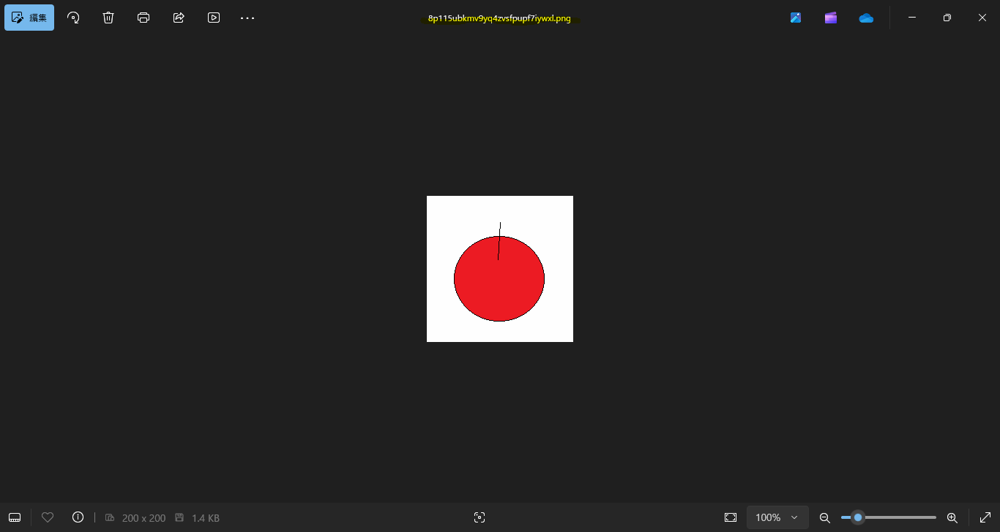
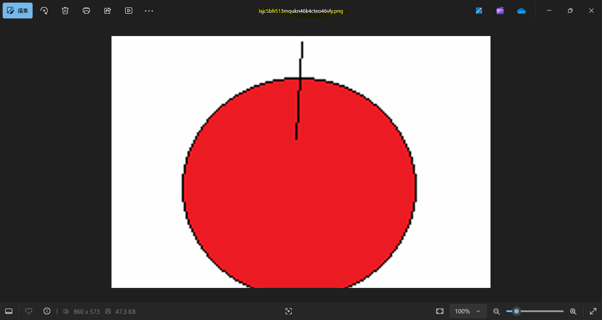
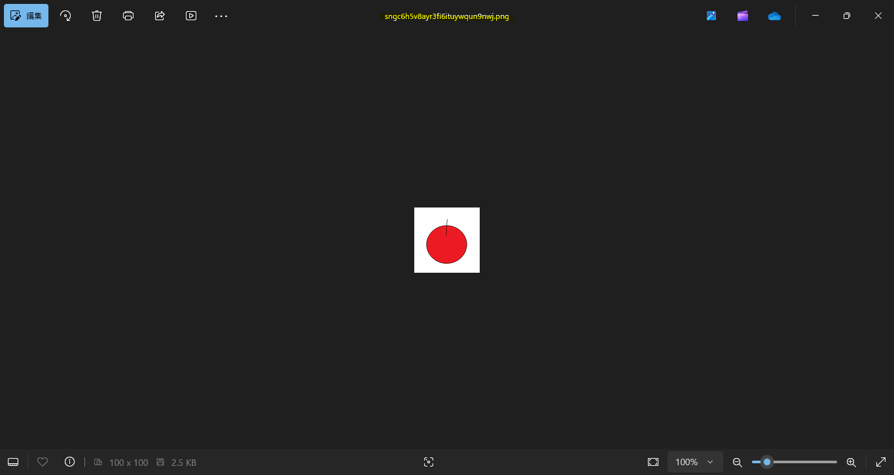

### 削除動作
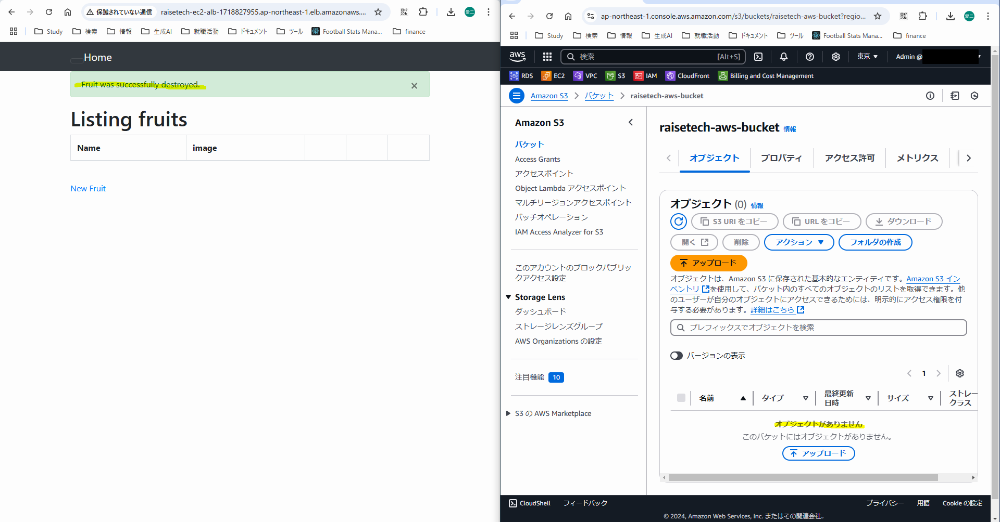

## AWS構成図

