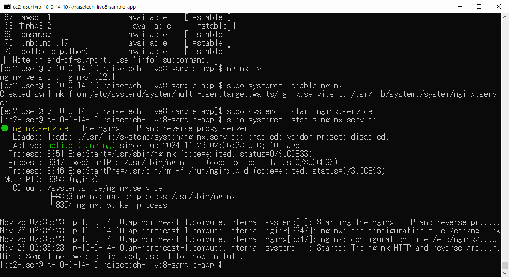

# 第5回課題

## サンプルアプリケーションのデプロイおよび動作

### PumaでのRailsアプリ動作確認

### 組み込みサーバーとUnix Socketを使ったRailsアプリの動作確認

### Nginxの単体起動確認

### Nginxと組み込みサーバー、Unix Socketを組み合わせてのRailsアプリケーション動作確認

## ELB(ALB)の追加

## S3の追加

### 登録動作
#### 登録前

#### 登録後

#### Home遷移後

#### S3内の各画像

### 削除動作

## AWS構成図

