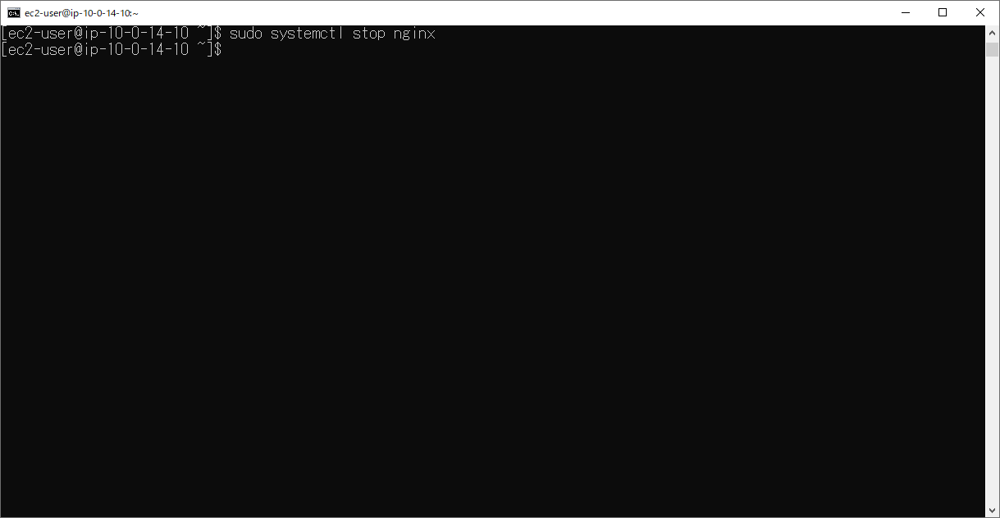
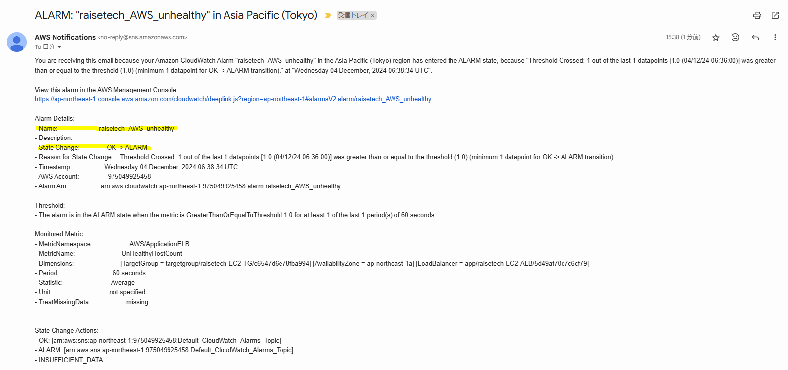
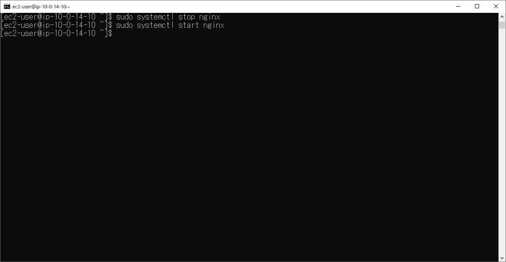
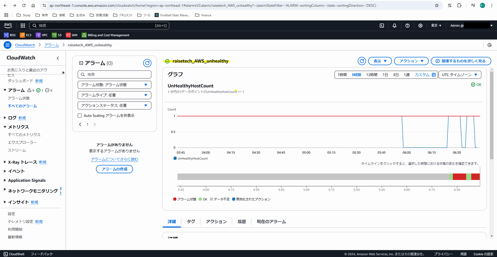
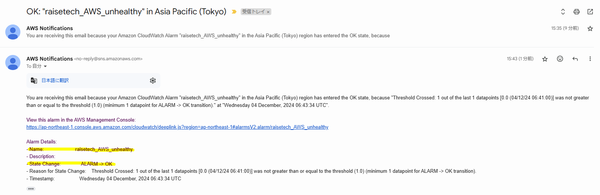
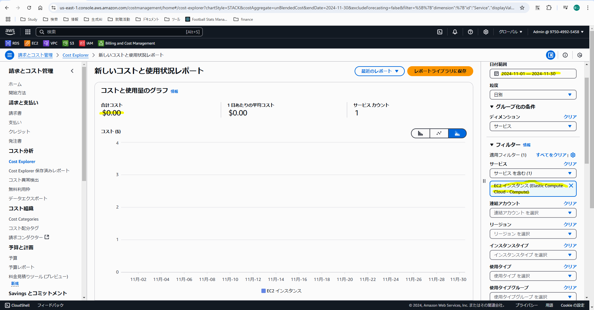
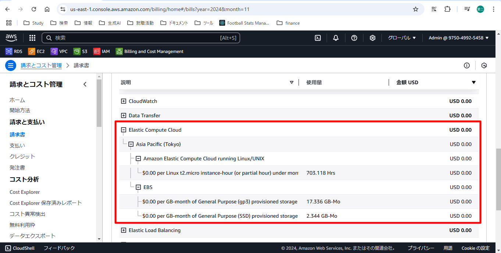

# 第6回課題

## CloudTrailのログ確認
12/2（月）（第5回課題取り組み時）のログを以下に3つ示します。

### RegisterTargets<br>
- ユーザー名：Admin
- イベント名：RegisterTargets
- その他①："eventTime": "2024-12-02T01:39:05Z"
- その他②："eventSource": "elasticloadbalancing.amazonaws.com"
- その他③：requestParameters（主にtargetのport番号を確認）<br>
```json
"requestParameters": {
    "targetGroupArn": "arn:aws:elasticloadbalancing:ap-northeast-1:975049925458:targetgroup/raisetech-EC2-TG/c6547d6e78fba994",
    "targets": [
        {
            "id": "i-02c2386650209d5e7",
            "port": 80
        }
    ]
}
```
<br>

### StopInstances<br>
- ユーザー名：Admin
- イベント名：StopInstances
- その他①："eventTime": "2024-12-02T08:57:37Z"
- その他②："eventSource": "ec2.amazonaws.com"
- その他③：responseElements（主にイベント前後のインスタンスのstateを確認）<br>
```json
"responseElements": {
    "requestId": "e50cfd4e-e1f0-4e9e-8ddc-3ab519259127",
    "instancesSet": {
        "items": [
            {
                "instanceId": "i-02c2386650209d5e7",
                "currentState": {
                    "code": 64,
                    "name": "stopping"
                },
                "previousState": {
                    "code": 16,
                    "name": "running"
                }
            }
        ]
    }
},
```
<br>

### StopDBInstance<br>
- ユーザー名：Admin
- イベント名：StopDBInstance
- その他①："eventTime": "2024-12-02T08:58:01Z"
- その他②："eventSource": "rds.amazonaws.com"
- その他③：responseElements（主にDBエンジンや容量等の基本設定を確認）<br>
```json
"responseElements": {
    "dBInstanceIdentifier": "raisetech-rds",
    "dBInstanceClass": "db.t4g.micro",
    "engine": "mysql",
    "dBInstanceStatus": "stopping",
    "masterUsername": "root",
    "endpoint": {
        "address": "raisetech-rds.cxaequ22g45k.ap-northeast-1.rds.amazonaws.com",
        "port": 3306,
        "hostedZoneId": "Z24O6O9L7SGTNB"
    },
    "allocatedStorage": 20,
    "instanceCreateTime": "Nov 21, 2024, 6:54:47 AM",
    // 以下省略
}
```
<br>

## CloudWatchでのALBアラーム設定
### Alert時状況
- Nginxを停止<br>

<br>

- CloudWatchコンソール画面<br>

<br>

- Alert受信メール<br>

<br>

### OK確認
- Nginxを起動<br>

<br>

- CloudWatchコンソール画面<br>

<br>

- OK受信メール<br>

<br>

## AWS利用料
### 見積作成
[こちらのURL](https://calculator.aws/#/estimate?id=4a6ea04d8ee7aa77e871dedbb5c32d57c7124f9c)からご確認ください。
<br>

### 先月のEC2利用料
11月のEC2の利用料は無料枠内で収まっています。
Javaフルコース後に作ったポートフォリオをほぼずっと稼働させていましたが、EC2の稼働時間上限750h、EBSボリューム上限30GBをいずれも下回っています。

